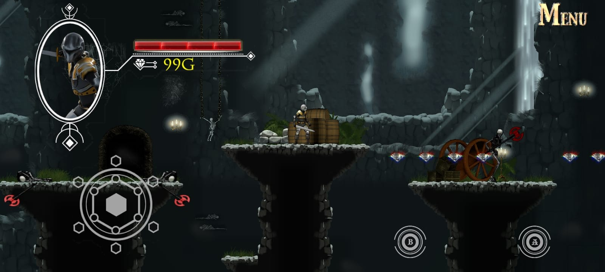
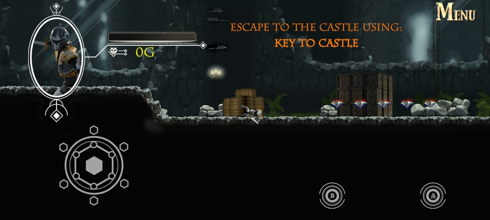
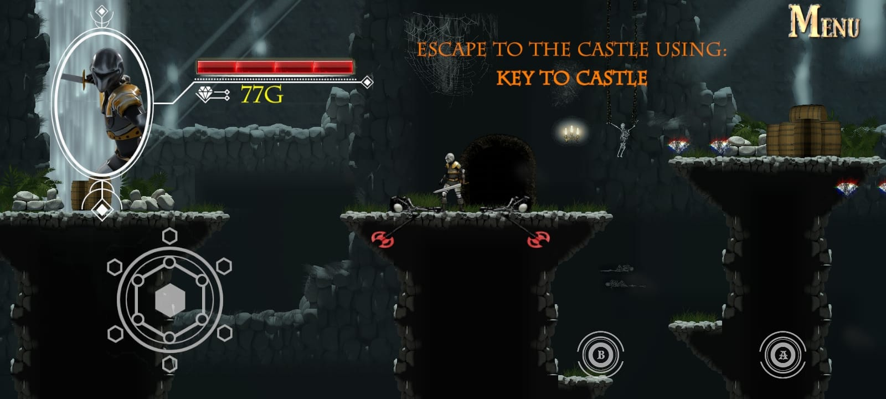

# Dungeon Escape: Sentinel's Quest
> ## Introduction
> Dungeon Escape: Sentinel's Quest is an Android-based video game developed in Unity. It involves the player to navigate a dungeon infested with a multitude of monsters on the lookout. 
>
> The only sign of civilization in the depths of gloom is a merchant, who becomes vital because he possesses the Key To Castle - the player's only glimmer of hope. Alas! Nothing in this world is free of cost, not even when you are being hunted.

> ## Citation
> Some of the assets used in this project originate from GameDevHQ's course titled:
**"The Ultimate Guide to 2D Mobile Game Development with Unity."**
>
> However, the gameplay and mechanics of this video game are fundamentally different from the original course project. \
This game represents an original concept and development effort, using those assets as a base.

> ## Releases
> The ```.apk``` file of the video game is attached to the Releases page of this repository. Install the ```.apk``` file of the latest version.





Thank You! \
**Aditya VN Kadiyala**
